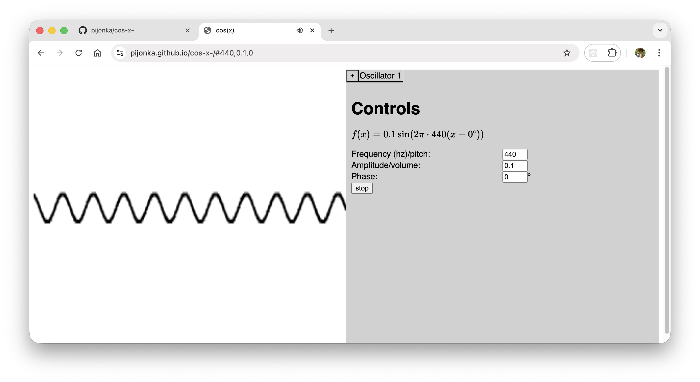

# Cos(x), a tab-based sound wave generator

Cos(x) is a web app that audibly and visually generates sound waves with a set frequency, amplitude, and phase. You can create and delete instances of mulitple sound waves, which can be stacked on top of each other to hear and visualize different combinations of sound waves. Sessions are saved in the URL of the website, and can be copied and stored for later usage by pasting the URL back into a search bar.

Cos(x) is useful for research on the relationship between different sound waves and their inherent properties. The automatically generated mathematical function that represents the generated waves can be used with external software to compute and graph waves (e.g. for research papers). Alternatively, the FFT-based graph on the left side of the screen offers a visual representation of the wave, though it lacks axes.

## Link
https://pijonka.github.io/cos-x-/

## Usage
- Use the frequency, amplitude, and phase input bars to control the sound wave being processed. Note: changes in phase go into effect only when a sound wave starts.
- To save session, copy the full URL and save it anywhere. Note: Bookmarks do not save the full link on Google Chrome or Safari.
- To restore session, paste the URL into a browser. Note: the state of the wave (whether it is active/inactive) is not restored.